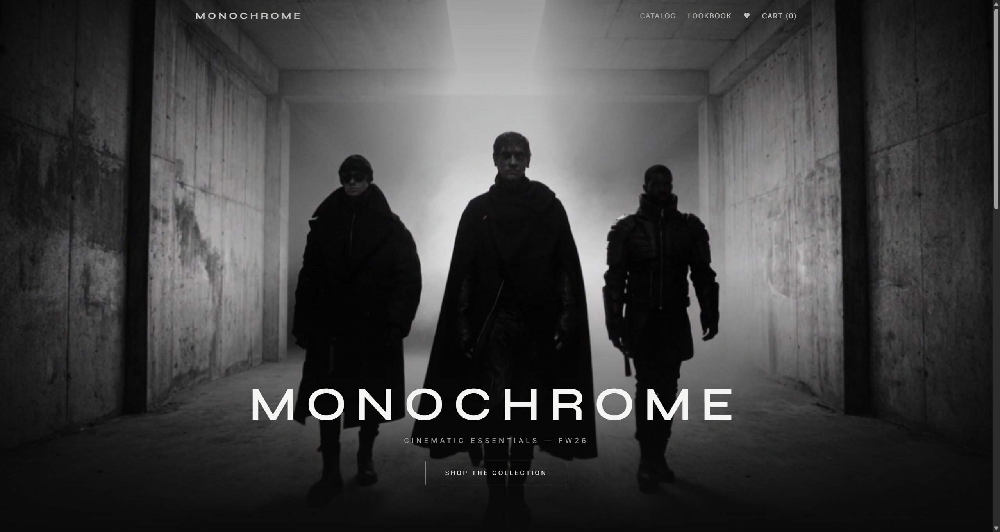
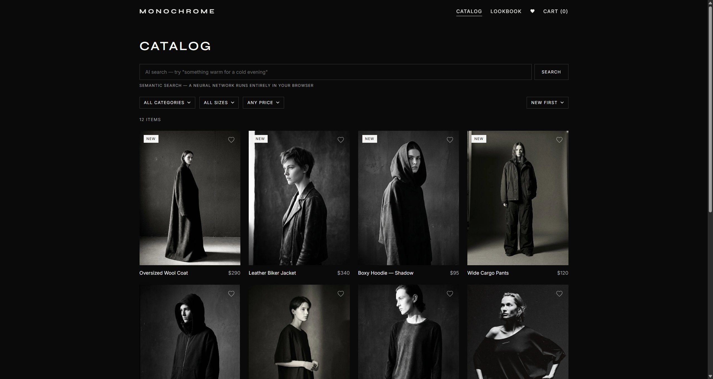
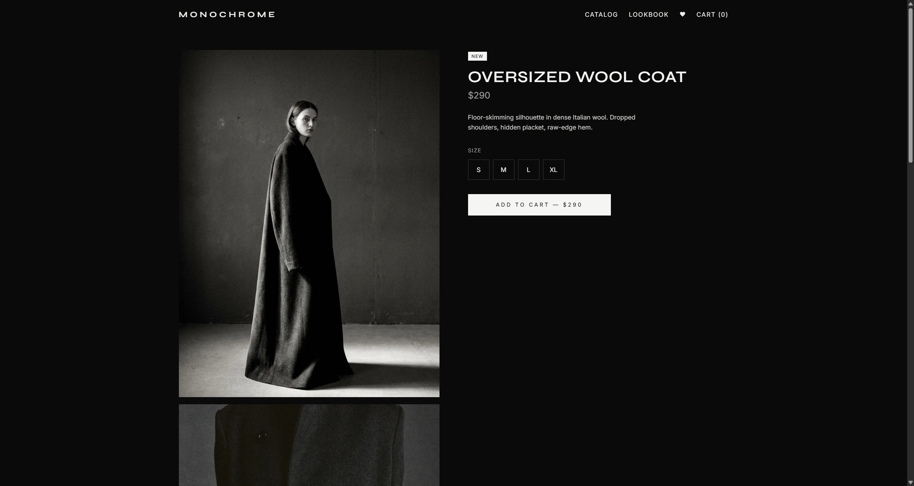

# MONOCHROME — concept fashion store

[](https://github.com/M1rwana12/monochrome-store/actions/workflows/ci.yml)


**Live demo:** [monochrome-store on Cloud Run](https://monochrome-store-117848350117.europe-central2.run.app)

A cinematic fashion e-commerce SPA where **every photo and video is AI-generated**
with [Higgsfield](https://higgsfield.ai), and product search is powered by a
**neural network running entirely in the visitor's browser**.

| Home | Catalog | Product |
|---|---|---|
|  |  |  |

## Stack

React 18 · TypeScript (strict) · Vite · Tailwind CSS v4 · Framer Motion ·
Transformers.js · Vitest · Playwright · Docker/nginx · Google Cloud Run

## Features

- **On-device semantic search** — all-MiniLM-L6-v2 via Transformers.js runs in the
  browser: type *"something warm for a cold evening"* and products are ranked by
  meaning, not keywords. No server, no API keys.
- **AI-generated media pipeline** — 24 photos + 7 videos (hero, lookbook, hover
  loops) generated with Higgsfield under a single art direction; hover a
  new-collection card and the photo comes alive.
- Catalog with URL-driven filters (category / size / price / sort) — links are shareable
- Favorites and cart with localStorage persistence, demo checkout
- Accessible by construction: focus-trapped drawer, Esc everywhere, custom
  ARIA-listbox selects, `prefers-reduced-motion` support
- Route-level code splitting + LazyMotion, WebP media (−42%), skeleton loaders
- SEO: schema.org Product JSON-LD, generated sitemap/robots, OG tags, llms.txt
- CI: lint → 28 unit tests → strict build → 7 Playwright E2E on every push

## Run locally

```bash
npm install
npm run dev        # dev server
npm test           # unit tests (Vitest)
npm run test:e2e   # E2E (Playwright)
npm run build      # typecheck + production build (+ sitemap generation)
```

## Deploy

Deployed on **Google Cloud Run** (Dockerfile: node build stage → nginx with SPA
fallback):

```bash
gcloud run deploy monochrome-store --source . --region europe-central2
```

Also deploy-ready for Vercel (`vercel.json`) and Netlify (`public/_redirects`).

## How it's made

Every image and video was generated with Higgsfield models under one art
direction (dark graphite studio, dramatic light, film grain):

- **Photos:** `soul_2` and `nano_banana_pro` (text-to-image, image-to-image for
  consistent second angles of the same garment)
- **Videos:** `kling3_0_turbo` (image-to-video from the product stills, 5s loops)
- **Hero poster:** upscaled to 2K with `bytedance_image_upscale`

**Fun production story:** the first prompt included the phrase *“Vogue editorial
style”* — and the model took it literally, rendering most product shots as full
VOGUE magazine covers, complete with mastheads, fake headlines and barcodes.
Negative instructions (“no text, no logos”) didn’t help: the dark-editorial
aesthetic is so strongly tied to magazine covers in the training data that the
layout kept coming back. The fix was switching model (`soul_2` →
`nano_banana_pro`) and reframing the prompt from *“editorial photograph”* to
*“cinematic fashion film still”* — every regenerated frame came out clean.
A good reminder that prompt vocabulary carries hidden layout priors.

---

*Portfolio project — no real orders, no payments. © 2026*
